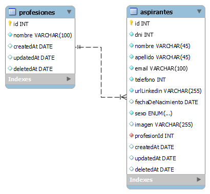

# Proyecto de catálogo de aspirantes - Recruiting de Recursos Humanos

Este proyecto consiste en una plataforma web desarrollada para una empresa multinacional de Recruiting de Recursos Humanos. El objetivo principal es ofrecer a nuestro público un catágolo en línea donde puedan explorar y evaluar a los aspirantes para puestos de trabajo altamente demandados en la industria.

## 🔧 Tecnologías utilizadas

### 🎨 Frontend 

- React
- JavaScript
- Tailwind CSS
- Consumo de API REST

### 📚 Backend

- MySQL
- dbdiagram.io (modelado de la base de datos)
- Seed
- Node.js
- Express.js
- Modelo MVC
- API REST

### 👨‍👨‍👦‍👦 Metologías y herramientas

- Git
- Github
- Kanban
- Scrum

### 🖌 Diseño

- Wireframe para el maquetado
- Fuentes:
- Colores:

### 🍦 Soft skills

- Adaptación y flexibilidad al cambio
- Autonomía
- Organización
- Trabajo en equipo
- Comunicación asertiva
- Resolución de problemas

### Contribución y colaboración

¡Nos encantaría que te involucres en este proyecto! Si tienes alguan idea, sugerencia o deseas contribuir, no dudes en abrir un issue o enviar un pull request. Juntos podemos mejorar continuamente esta plataforma para ofrecer la mejor experiencia a nuestros usuarios y aspirantes.

> [!Important]
> 

> [!Note]
> La documentación de la api esta en progreso
> Mas adelante agragaremos mas tecnologías, usos y descripciónes del proyecto
